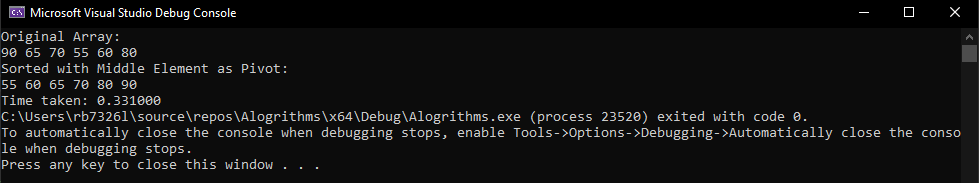

## Lab 9: Algorithms 

- Linear Search Example, $O(n)$

- Binary search $O(log\ n)$ code example:

- Exponential growth is $O(2^n)$, Fibonacci:

- 

> Note: 
>> - All timings are based on an 11th Gen Intel Core i5-11500 @ 2.70GHz 6 Cores.
>> - The C library function `clock_t clock(void)` returns the number of `clock ticks` elapsed since the program was launched. To get the number of seconds used by the CPU, you will need to divide by `CLOCKS_PER_SEC`, which will be implemented in `main()`.

## Merge Sort Algorithm \\(O(n\ log\ n)\\): 

1. Create a new C++ Console Application call it `Algorithms`. Remember to modify the `Algorithms.cpp` so that it is a c file `Algorithms.c`

2. Creat a header and C file called `Sort.h` and `Sort.c`. 

The algorithm works by first: 

- **Divide and Conquer**: Quicksort is a fast, efficient sorting algorithm, that uses a divide-and-conquer strategy to sort an array.

- **Picking a Pivot:** It starts by selecting a 'pivot' element from the array.

- **Partitioning:** The array is then partitioned into two parts – elements less than the pivot are moved before it, and elements greater than the pivot are moved after it.

- **Recursive Sorting:** This partitioning creates a "partial order". The algorithm then recursively applies the same process to the sub-arrays formed by the partition.

As you can probably tell, the main process in a quicksort algorithm is the partitioning phase.

We are going to sort some heights of various people: `int array1[] = {90, 65, 70, 55, 60, 80};`

To achieve our goal, we'll start by picking one kid, and we'll make them our pivot.

The next step is to ask all kids who are shorter than our pivot to stand on one side, while those who are taller will stand on the other side.

At this stage, we have a partially sorted group of kids, but unless we manage to pick the kid in the middle of the group and all the other kids are already sorted in height order, we need to do more sorting.

That's where recursion comes in, as we'll have to keep repeating this process for each partition (group) of kids on either side of the pivot.

So, we'll select the group of shorter or taller kids, pick a new pivot in that group, and then ask the shorter kids to move to one side and the taller kids to move to the other side.

If we started with the shorter group, we'd then move on to the taller group on the other side of our original pivot and do the same thing.

The net result is that we've now partially sorted our kids even more.

And as you've probably guessed, we'll keep repeating this process until all the kids are fully sorted by height.

3. Reproduce the following code in `Sort.h`:

    ```c
    #pragma once
    #ifndef SORT_H
    #define SORT_H

    #include <stdio.h>
    #include <stdlib.h>
    #include <time.h>

    void quicksortMiddle(int arr[], int low, int high);

    void printArray(int arr[], int size);
    #endif // SORT_H
    ```
4. Reproduce the following code in `Sort.c`:

    ```c
    #include "Sort.h"

    void quicksortMiddle(int arr[], int low, int high) {
        if (low < high) {
            int pivot = arr[(low + high) / 2]; // Selecting the middle element as the pivot
            int i = low;
            int j = high;
            int temp;

            while (i <= j) {
                while (arr[i] < pivot) i++; // Moving elements smaller than pivot to the left
                while (arr[j] > pivot) j--; // Moving elements greater than pivot to the right

                if (i <= j) {
                    temp = arr[i];         // Swapping elements
                    arr[i] = arr[j];
                    arr[j] = temp;
                    i++;
                    j--;
                }
            }

            // Recursively sort the two partitions
            if (low < j) quicksortMiddle(arr, low, j);
            if (i < high) quicksortMiddle(arr, i, high);
        }
    }

    // Utility function to print array
    void printArray(int arr[], int size)
    {
        for (int i = 0; i < size; i++)
        {
            printf("%d ", arr[i]);
        }
        printf("\n");
    }
    ```

5. `Algorithms.c` modify the code to include the following:

```c
#include <stdio.h>
#include <time.h>
int main()
{

    int array1[] = {90, 65, 70, 55, 60, 80}; // partially sorted array of heights
    
    int n = sizeof(array1) / sizeof(array1[0]); // get the middle of the array

    printf("Original Array: \n");
    printArray(array1, n);

    clock_t start, end; // Set up variables to time the algorithm
    double cpu_time_used;
    start = clock(); // start the timer
    
    
    for (int i = 0; i < 10000000; i++) {
        // Using the Middle Element as Pivot    
        quicksortMiddle(array1, 0, n - 1);
    }

    end = clock(); // end the timer
    cpu_time_used = ((double)((double)end - (double)start)) / CLOCKS_PER_SEC; // calculate the time taken

    printf("Sorted with Middle Element as Pivot:\n");
    printArray(array1, n);
    printf("Time taken: %lf", cpu_time_used); 

    return 0;
}
```

Output: 



Timing:  0.331000/10,000,000 = 33.1*10^-8 =  33.1ns on an 

 Quick Sort 


Bubble Sort


Selection Sort


Insertion Sort


