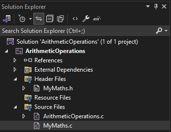
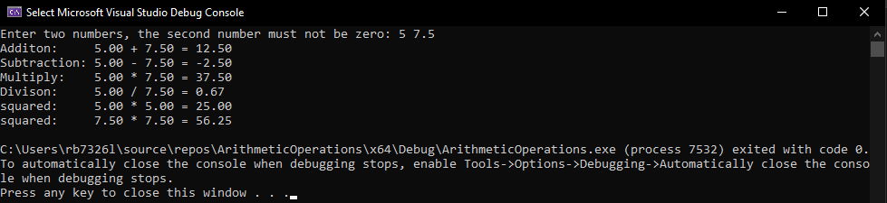

# Lab n:  Arithmetic Operations

## Task 1

Write a program with functions to perform basic arithmetic operations (addition, 
subtraction, multiplication, and division). Each operation should be in its own function.

1. Open a new project called `Arthimetic Operations`

2. Create a new header file by following the images below, and call the file `MyMaths.h`:

   - 

   -  

3. Next create a Guard for the new header file: 
    ```h
    #pragma once

    #ifndef MYMATHS_H
    #define MYMATHS_H

    #endif
    ```

4. Now we are ready to place declare for reference various arithemtic functions. Add the following functions where the parameters are `floats`:
    - add
    - subtract
    - multiply
    - divide
    - square 

    <details>
    <summary>Possible Solution...</summary>

    ```h
    #pragma once

    #ifndef MYMATHS_H
    #define MYMATHS_H

    float add(float a, float b);
    float subtract(float a, float b);
    float multiply(float a, float b);
    float divide(float a, float b);
    float square(float a, float b);

    #endif // End of Guard
    ```

    </details>

5. To provide the actual code for each of these functions in `MyMaths.h`, create a new file in in the Sources File directory, similarly to how you created the `MyMaths.h` file, and call it `MyMaths.c`. You should have the following solution structure: 

<div align=center>



</div>

>**Note:**
>> You may need to rename the `ArthimeticOperations.cpp` to `ArthimeticOperations.c` if you have not done so already.

6. Modify the content on `MyMaths.c` so that it `includes` the `MyMaths.h` file:
    
    <details>
    <summary>Possible Solution...</summary>

    `#include "MyMaths.h"`

    </details>

7. Now start to build out the functionality of each of the arthimetic functions you declared in the `MyMaths.h` file:

    - add
    - subtract
    - multiply
    - divide
    - square 

    <details>
    <summary>Possible Solution</summary>

    ```c
    #include "MyMaths.h"

    float add(float a, float b)
    {
        return a + b;
    }

    float subtract(float a, float b)
    {
        return a - b;
    }

    float multiply(float a, float b)
    {
        return a*b;
    }

    float divide(float a, float b)
    {
        
        return a/b;
    }

    float square(float a)
    {
        return a*a;
    }
    ```

    </details>

8. Now we need to go back to `ArthimeticOperations.c` and modify the contents so that it `includes` `stdio.h` and `MyMaths.h` and remove the code in side the `main()` block (keeping the `return 0;`), do this now:

    <details>
    <summary>Possible Solution</summary>

    ```c
    #include <stdio.h>
    #include "MyMaths.h"

    int main()
    {

        return 0;
    }
    ```

    </details>

9. Declare two `float`s as `num1` and `num2` initialising them with the value `0.0f` inside of `main()`:

    <details>
    <summary>Possible Solution</summary>

    ```c
    int main(){

        float num1 = 0.0f, num2 = 0.0f;

        return 0;
    }
    ```

    </details>

10. Using `printf`, request the user to enter two numbers with second number that must be greater than zero. Then using `scanf_s` read what the user inputted and assign those two numbers to `num1` and `num2`.

    <details>
    <summary>Possible Solution</summary>

    ```c
    int main(){

        float num1 = 0.0f, num2 = 0.0f;
        printf("Enter two numbers, the second number must not be zero: ");
        scanf_s("%f %f", &num1, &num2);

        return 0;
    }
    ```

    </details>

11. Reproducing the following format perform each of the arithmetic operations on the supplied numbers, you will need to do square twice, one for each number: 

    `printf("<Arithemtic Operation>:     %.2f + %.2f = %.2f\n", num1, num2, arithmeticOpeation(num1, num2));`

    <details>
    <summary>Possible Solution</summary>

    ```c
    int main(){

    float num1 = 0.0f, num2 = 0.0f;
    printf("Enter two numbers, the second number must not be zero: ");
    scanf_s("%f %f", &num1, &num2);
    
    printf("Additon:     %.2f + %.2f = %.2f\n", num1, num2, add(num1, num2));
    printf("Subtraction: %.2f - %.2f = %.2f\n", num1, num2, subtract(num1, num2));
    printf("Multiply:    %.2f * %.2f = %.2f\n", num1, num2, multiply(num1, num2));
    printf("Divison:     %.2f / %.2f = %.2f\n", num1, num2, divide(num1, num2));
    printf("squared:     %.2f * %.2f = %.2f\n", num1, num1, square(num1));
    printf("squared:     %.2f * %.2f = %.2f\n", num2, num2, square(num2));

    return 0;
    ```

    </details>

12. **Output:**
    

## Task 2

Let's further modify the solution so we can do some meaningful programming. In this task you will create a temperature conversion tool. 

13. Create a new Header file and c file in the respective locations called:
    - `TemperatureConversion.h`
    - `TemperatureConversion.c`

14. Open `TemperatureConversion.h` and add a guard

15. Inside the block ifndef block define the functions to convert to and from fahrehnhiet, celcius and kelvin, so there should be six functions altogether. The functions should return a `float` and take only one `float` as an argument:

<details>
<summary>Possible Solution...</summary>

```h
#pragma once
#ifndef TEMPEATURECONVERSION_H
#define TEMPEATURECONVERSION_H

double fahrenheitToCelcius(double fahr);
double fahrenheitToKelvin(double kel);

double celciusToFahrenheit(double cel);
double celiusToKelvin(double cel);

double kelvinToCelius(double kel);
double kelvinToFahrenheit(double kel);

#endif // !TEMPEATURECONVERSION_H
```

</details>

16. Next build up the `TempeatureConversion.c` file:
    - include the `TemperatureConversion.c`
    - use the following formulas to convert between each temperature:
        - 


    <details>
    <summary>Possible Solution...</summary>

    ```c
    #include "TemperatureConversion.h"

    double fahrenheitToCelcius(double fahr) {
        return (5.0 / 9.0) * (fahr - 32.0);
    }

    double fahrenheitToKelvin(double fahr){
        return ((fahr - 32) / 1.79999999) + 273.15;
    }


    double celciusToFahrenheit(double cel){
        return (cel * (9.0 / 5.0))+ 32.0 ;
    }

    double celiusToKelvin(double cel) {
        return (cel + 273.15);
    }

    double kelvinToCelius(double kel) {
        return (kel - 273.15 );
    }

    double kelvinToFahrenheit(double kel) {
        return ((kel - 273.15) * 1.8) + 32.00;
    }
    ```

    </details>